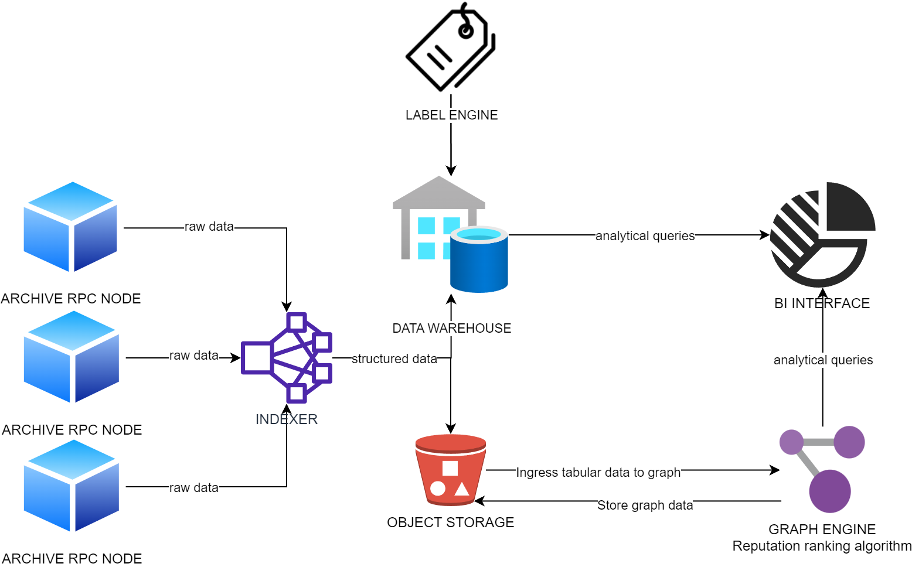

# **Pipeline for Octan Network**  
The pipeline collects data from multiple blockchains, processes them, then provides as data-inputs for [reputation ranking system](https://github.com/Octan-Labs/Reputation-scoring) and warehouse to build an onchain analytics platform.
---------------------------------

Support cloud native deployment (kubernetes) with autoscaler
Fork from [blockchain-etl](https://github.com/blockchain-etl/ethereum-etl)
# Features

- evm indexer: `./indexer`
    + export file format:
        + [X] csv
        + [X] json new line
        + [X] parquet
        + [ ] iceberg (depend on [issue](https://github.com/apache/iceberg/issues/6564))
    + export sink:
        + [X] s3
        + [X] local
        + [X] other filesystem follow fsspec (not tested, but highly compatible)
    + streaming sink:
        + [X] kafka
        + [X] kinesis
        + [X] postgres
        + [ ] clickhouse
    + trace specs:
        + [X] parity traces
        + [X] geth traces (only export)
- scheduler/monitor: airflow
- graph processing
    + [X] graphframes (deprecated)
    + [X] graphscope
- resilient in memory distributed storage
    + [ ] vineyard v6d
- algorithm:
    + [X] contract classification
    + [X] in degree
    + [X] pagerank
    + [ ] labeling
    + [ ] fraud detection
    + [ ] bot detection

# Structure

- docker: build of docker image
- k8s: yaml resources for k8s components
- docs
