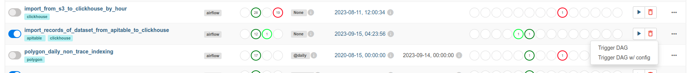
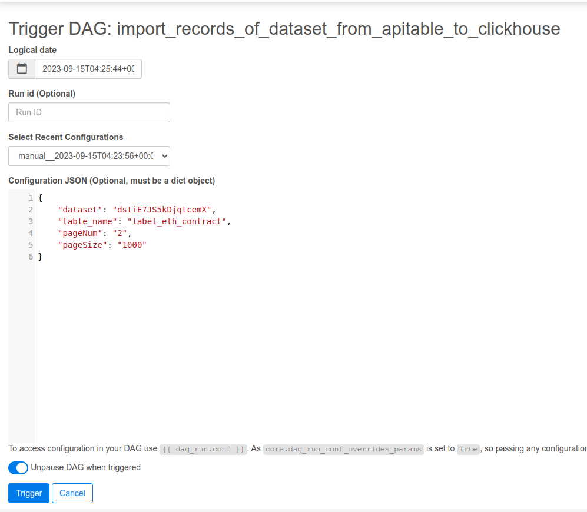
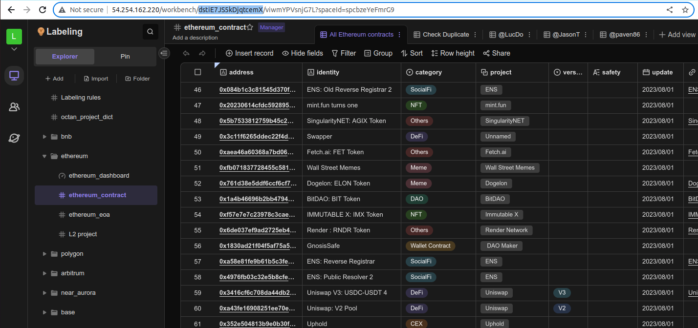
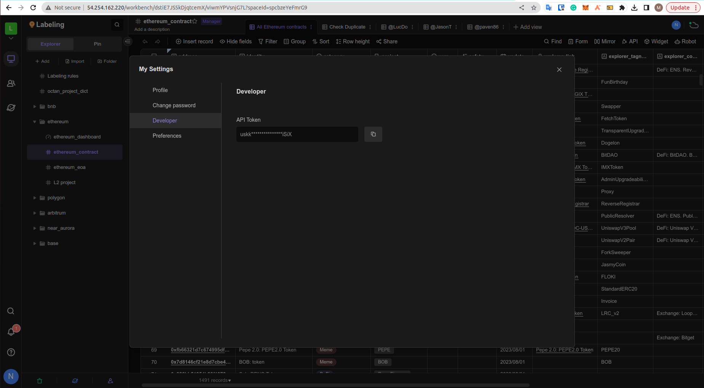

## How to run DAG

1. Trigger DAG with config
   

2. Example configuration then Trigger
   

## How to get ID of dataset & apitable API key

##### - Get ID of dataset

[ethereum_contract_dataset](http://54.254.162.220/workbench/dstiE7JS5kDjqtcemX/viwmYPVsnjG7L?spaceId=spcbzeYeFmrG9)

=> ID of ethereum_contract_dataset is "dstiE7JS5kDjqtcemX"

##### - Get apitable API key

##### Get records of dataset (https://developers.aitable.ai/api/get-records)
